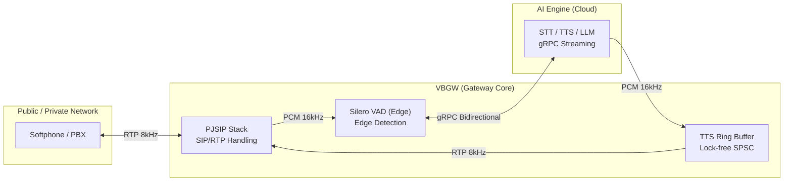

# 🎙️ Voicebot Gateway (VBGW) — Enterprise Edition

[](https://en.cppreference.com/w/cpp/20)
[](https://opensource.org/licenses/MIT)
[]()

**Voicebot Gateway(VBGW)**는 전화망(PJSIP)과 AI 엔진(gRPC) 사이의 **초저지연(Low-latency) 실시간 음성 중계 시스템**입니다. 
단순한 녹음 후 전송 방식이 아니라, 스트리밍 방식으로 사용자의 목소리를 듣는 동시에 대답하며, 사용자가 말을 끊으면 즉시 반응하는 **Barge-in** 기능을 탑재한 기업용 콜봇 솔루션의 핵심 엔진입니다.

---

## 🏗️ 1. 아키텍처 (Architecture Overview)

VBGW는 세 가지 핵심 레이어가 조화롭게 작동합니다.



- **PJSIP**: 고성능 SIP 스택을 통해 전화 호 제어 및 RTP 미디어 송수신 처리.
- **Edge VAD**: 서버 사이드(AI)로 음성을 보내기 전, 게이트웨이 단계에서 **Silero VAD(ONNX)**를 사용하여 사용자 발화 여부를 즉시 판단.
- **Barge-in**: 사용자가 AI의 답변 도중 말을 하면, 실시간으로 재생 중인 버퍼를 Flush하고 다시 듣기 모드로 전환.

---

## 🛠️ 2. 환경 설치 (Installation Guide)

이 프로젝트는 **macOS (Apple Silicon)** 환경을 기준으로 작성되었으며, Linux(Ubuntu)에서도 동일한 라이브러리 설치 후 빌드 가능합니다.

### 2.1 필수 도구 설치 (macOS Homebrew)

터미널을 열고 아래 명령어를 한 줄씩 실행하세요.

```bash
# 1. 패키지 관리자 업데이트
brew update

# 2. 핵심 라이브러리 설치
brew install cmake pjproject grpc protobuf openssl spdlog boost onnxruntime
```

### 2.2 VAD 모델 준비
VAD 성능 극대화를 위해 `Silero VAD` 모델 파일이 필요합니다.
1. 프로젝트 루트에 `models` 폴더를 만듭니다.
2. [Silero VAD ONNX 모델](https://github.com/snakers4/silero-vad/raw/master/files/silero_vad.onnx)을 다운로드하여 `models/silero_vad.onnx` 경로에 위치시킵니다.

---

## 🏗️ 3. 프로그램 빌드 (Build)

표준 CMake 빌드 절차를 따릅니다.

```bash
# 1. 빌드 폴더 생성 및 이동
mkdir -p build && cd build

# 2. CMake 설정 (의존성 체크)
cmake ..

# 3. 컴파일 (병렬 빌드로 속도 향상)
cmake --build . --parallel $(sysctl -n hw.ncpu)
```

빌드가 완료되면 `build/vbgw` 실행 파일이 생성됩니다.

---

## ⚙️ 4. 환경 변수 설정 (Configuration)

VBGW는 코드 수정 없이 환경 변수만으로 모든 동작을 제어할 수 있는 **Production-ready** 설정을 지원합니다.

1. 예제 파일을 복사하여 `.env` 파일을 생성합니다.
   ```bash
   cp config/.env.example .env
   ```
2. `.env` 파일을 열어 주요 설정을 확인합니다.

| 변수명 | 설명 | 기본값 |
| :--- | :--- | :--- |
| `SIP_PORT` | SIP 신호 수신 포트 | 5060 |
| `AI_ENGINE_ADDR` | AI 엔진(STT/TTS) 주소 | localhost:50051 |
| `MAX_CONCURRENT_CALLS` | 최대 동시 통화 수 | 100 |
| `TTS_BUFFER_SECS` | AI 답변을 담아둘 버퍼 크기 | 5 |
| `LOG_LEVEL` | 로그 상세도 (debug/info/warn) | info |

3. 실행 전 환경 변수를 로드합니다.
   ```bash
   source .env
   ```

---

## 🎧 5. 테스트 및 실행 가이드 (Testing Guide)

초보자도 따라 할 수 있는 3단계 실습 가이드입니다.

### Step 1: AI 에뮬레이터(모의 서버) 실행
진짜 AI 서버가 없어도 테스트할 수 있는 Python 에뮬레이터를 먼저 실행합니다.

```bash
# 새 터미널 창
cd src/emulator
python3 -m venv venv
source venv/bin/activate
pip install -r requirements.txt

# 에뮬레이터 구동
python mock_server.py
```

### Step 2: VBGW 게이트웨이 실행
이제 게이트웨이 엔진을 가동합니다.

```bash
# 다른 터미널 창
source .env
./build/vbgw
```

### Step 3: 전화 걸기 (Softphone)
1. **Linphone**과 같은 SIP 소프트폰 앱을 다운로드합니다.
2. 주소창에 `sip:voicebot@127.0.0.1:5060`을 입력하고 전화를 겁니다.
3. **테스트 시나리오**:
    - **인사 해보기**: "안녕하세요?"라고 말하면 에뮬레이터에서 삐- 소리와 함께 답변이 옵니다.
    - **말 끊기(Barge-in)**: AI가 삐- 소리를 내며 답변하는 도중에 내가 다시 시끄럽게 말을 하면, 즉시 소리가 끊기며 다시 내 말을 들을 준비를 합니다.

### Step 4: Outbound API E2E (Null Audio, 팀 온보딩 권장)
운영 시나리오와 가장 유사한 Outbound API 실콜 플로우를 로컬에서 빠르게 재현합니다.

```bash
# 최초 1회 (에뮬레이터 가상환경 준비)
cd src/emulator
python3 -m venv venv
source venv/bin/activate
pip install -r requirements.txt
cd ../..

# E2E 실행 (mock AI + vbgw + pjsua callee + outbound API 호출)
./scripts/e2e_outbound_null_audio.sh config/.env.local
```

- 성공 기준: `PASS: Outbound API E2E scenario completed successfully.`
- 제한 환경(샌드박스/오디오 장치 없음)에서는 `SKIP`이 정상일 수 있습니다.
- 상세 절차/강제 실패 옵션: `docs/testing.md`의 `Outbound API 실제 콜 E2E (Null Audio)` 섹션 참고

운영 배포 전에는 아래 검증도 함께 수행하세요.

```bash
VALIDATE_PROFILE=production REQUIRE_PRODUCTION_PROFILE=1 ./scripts/validate_prod_env.sh .env
```

---

## 🐳 6. Docker 배포 (Docker Deployment)

운영 환경에서는 Docker를 사용하여 쉽고 안전하게 배포할 수 있습니다.

```bash
# 1. 이미지 빌드
docker build -t vbgw:latest .

# 2. 컨테이너 실행 (UDP 포트 매핑 주의)
docker run -d \
  -p 5060:5060/udp \
  -p 16000-16100:16000-16100/udp \
  --env-file .env \
  --name vbgw-server \
  vbgw:latest
```

---

## ❓ 7. 트러블슈팅 (Troubleshooting)

### Q1. "Address already in use" 에러가 납니다.
이미 5060 포트를 다른 앱이 쓰고 있을 가능성이 큽니다. `lsof -i :5060` 명령어로 확인 후 종료하거나, `.env`에서 `SIP_PORT`를 다른 값으로 변경하세요.

### Q2. 소리가 들리지 않아요.
RTP 포트 범위(16000~16100)가 방화벽에서 열려 있는지 확인하세요. 로컬 테스트 시에는 방화벽을 잠시 끄는 것을 권장합니다.

### Q3. AI 엔진(gRPC) 연결 실패 에러가 납니다.
`AI_ENGINE_ADDR` 설정이 정확한지, 그리고 `mock_server.py`가 실행 중인지 다시 한번 확인해 주세요.

---

## 📜 8. 라이선스 (License)
이 프로젝트는 MIT 라이선스 하에 배포됩니다. 상업적 이용 및 수정이 자유롭습니다.

---
*Developed with Passion by the VBGW Team.*
